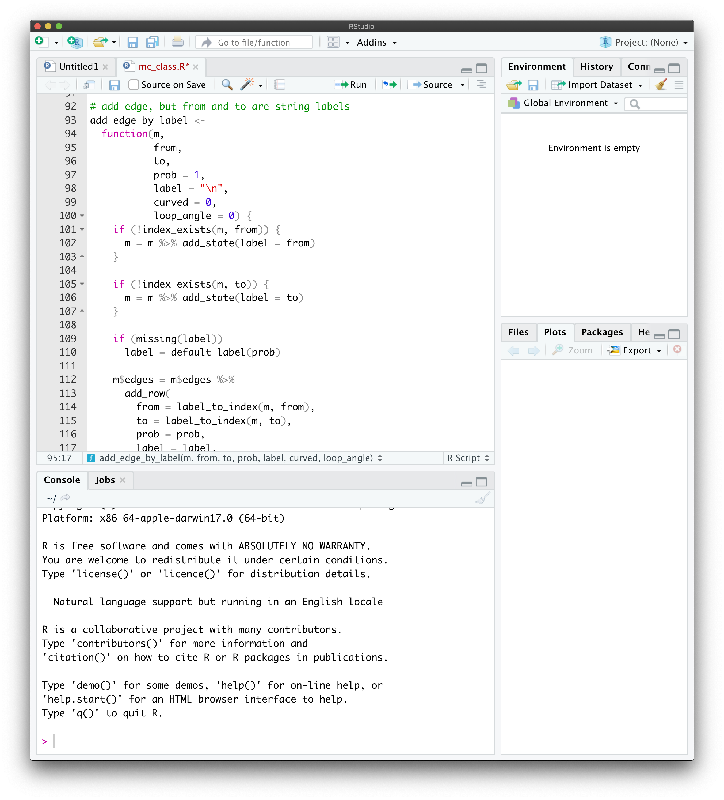

# An intro to R and RStudio {#intro}

## Setting up an R environment on your computer

### Installing R

Learning basic R is an important part of this course, and the first order of business is to download and install an R distribution on your personal computer. We will be using RStudio as an IDE (integrated development environment). Like R itself, it is free and readily available for all major platforms. To download R to your computer, go to
[https://cloud.r-project.org](https://cloud.r-project.org) and 
download the version of R for your operating system (Windows, Mac or Linux). If you are on a Mac, you want the "Latest release" which, at the time of writing, is 4.1.1, with code name "Kick Things". On Windows, follow the link "install R for the first time".  We are not going to do any cutting edge stuff in this class, so an older release should be fine, too, if you happen to have it already installed on your system. Once you download the installation file (.pkg on a Mac or .exe on Windows), run it and follow instructions. If you are running Linux, you don't need me to tell you what to do. Once it is successfully installed, **don't run the installed app**. We will use RStudio for that.

### Installing RStudio

To install RStudio, go to [https://rstudio.com/products/rstudio/download/](https://rstudio.com/products/rstudio/download/). There are several versions to choose from - the one you are looking for is "RStudio desktop - Free". After you download and install it, you are ready to run it. When it opens, you will see something like this

```{r echo=FALSE, out.width= "100%", fig.align='center',out.extra='style="padding:10px"'}
knitr::include_graphics('pics/RStudio_IDE.png')
```

The part on the left is called the *console* and that is (one of the places) where you enter commands. Before you do, it is important to adjust a few settings. Open the options window by navigating to to Tools->Global Options. In there, uncheck "Restore .RData into workspace on startup" and set "Save workspace to .RData on exit" to "Never", as shown below:
```{r echo=FALSE,out.width= "75%", out.extra='style="margin-left: 12.5%; margin-right:12.5%; padding:10px"'} 

```

This way, R will not pollute your environment with values you defined two weeks ago and completely forgot about. These settings are really an atavism and serve no purpose (for users like us) other than to introduce hard-to-track bugs. 

There are many other settings you can play with in RStudio, but the two I mentioned above are the only ones that I really recommend setting as soon as you install it. 


### Installing basic packages

Finally, we need to install several R packages we will be using (mostly implicitly) during the class. First, run the following command in your console
```markdown
install.packages( "tidyverse")
```
If R asks "Do you want to install from sources the packages which need compilation? (Yes/no/cancel)" answer no.

This will install a number of useful packages and should only take about a minute or two. The next part is a bit longer, and can take up to 15 minutes if you have a slow computer/internet connection.
You only have to do it once, though. Skip both steps involving `tinytex` below if you have LaTeX already installed on your system^[it may interfere with your existing installation].  Start with 
```markdown
install.packages("tinytex")
```
followed by 

```markdown
tinytex::install_tinytex()
```
Note that if you go to the top right corner of each of the code blocks (gray boxes) containing instructions above, an icon will appear. If you click on it, it will copy the content of the box into your clipboard, and you can simply paste it into RStudio. You can do that with any code block in these notes.

## Learning the  basics of R

Once R and RStudio are on your computer, it is time to get acquainted with the basics of R. This class is not about the finer points of R itself, and I will try to make your R experience as smooth as possible. After all, R is a tool that will help us explore and understand stochastic processes. Having said  that, it is important to realize that R is a powerful programming language specifically created for statistical and probabilistic applications. Some knowledge of R is a valuable skill to have in today's job market, and you should take this opportunity to learn it. The best way, of course, is by using it, but before you start, you need to know the very basics. Don't worry, R is very user friendly and easy to get started in. In addition, it has been around for a long time (its predecessor S appeared in 1976) and is extremely well documented -  google *introduction to R* or a similar phrase, and you will get lots of useful hits. 

My plan is to give you a bare minimum in the next few paragraphs, and then to explain additional R concepts as we need them. This way, you will not be overwhelmed right from the start, and you will get a bit of a mathematical context as you learn more. Conversely, learning R commands will help with the math, too.

### The console, Scripts and R Notebooks

There at least  three different ways of inputting commands into R - through console, scripts and R-notebooks.  

**The console**, as I already mentioned, is a window in RStudio where you can enter your R commands one by one. As a command is entered (and enter pressed) R will run it and display the result below. A typical console session looks like this
```{r echo=FALSE, out.width= "100%", fig.align='center',out.extra='style="padding:10px"'}
knitr::include_graphics('pics/console_session.png')
```
If you define a variable in a command, it will be available in all the subsequent commands. This way of interacting with R is perfect for quick-and-dirty computations and, what is somewhat euphemistically called "prototyping". In other words, this way you are using R as a calculator. There is another reason why you might be using the console. It is perfect for package installation and for help-related commands. If you type `help('log')`, the output will appear in the `Help` pane on the right. You can also see all the  available variables in the `Environment` pane on the (top) right. 

As your needs increase, you will need more complex (and longer) code to meet them. This is where **scripts** come in. They are text files (but have the extension `.R`) that hold R code. Scripts can run as a whole, and be saved for later. To create a new script, go to File->New File->R Script. That will split your RStudio window in two:
```{r echo=FALSE, out.width= "100%", fig.align='center',out.extra='style="padding:10px"'}

```
The top part will become a script editor, and your console will shrink to occupy the bottom part. You can write you code in there, edit and update it, and then run the whole script by clicking on Source, or pressing the associated shortcut key. 

Inspired by Python Jupyter notebooks, **R notebooks** are a creature somewhere between scripts and the console, but also have some features of their own. 
An R notebook is nothing other than a specially formatted text file which contains *chunks* of R code mixed with regular text. You can think of these chunks as mini scripts. What differentiates them from scripts is that chunks can be executed (evaluated) and the output becomes a part of the notebook:
```{r echo=FALSE, out.width= "100%", fig.align='center',out.extra='style="padding:10px"'}
knitr::include_graphics("pics/notebooks.png")
```
R notebooks are R's implementation of  *literate programming*. The idea is that documentation should be written at the same time as the program itself. As far as this course is concerned, R notebooks are just the right medium for homework and exam submission. You can run code and provide the interpretation of its output in a single document. See [here](other/Homework-instructions.html) for more information.

Each chapter in these lecture notes is an R notebook!

### Asking for help
The most important thing about **learning R** (and many other things, for that matter) is knowing whom (and how) to ask for help. Luckily, R is a well established language, and you can get a lot of information by simply googling your problem. For example, if you google `logarithm in R` the top hit (at the time of writing) gives a nice overview and some examples. 

Another way to get information about a command or a concept in R is to use the command `help`. For example, if you input `help("log")` or `?log` in your console, the right hand of your screen will display information on the function `log` and some of its cousins. Almost every help entry has examples at the bottom, and that is where I always go first. 

### Vectors {#vectors}

Objects we will be manipulating in this class are almost exclusively vectors and matrices. The simplest vectors are those that have a single component, in other words, numbers. In R, you can assign a number to a variable using two different notations. Both
```{r}
a <- 1
```
and
```{r}
a = 1
```
will assign the value $1$ to the variable `a`. If you want to create a longer vector, you can use the **concatenation operator** `c` as follows:
```{r}
x = c(1,2,3,4)
```
Once you evaluate the above in your console, the value of `x` is stored and you can access it by using the command `print`
```{r}
print(x)
```

or simply evaluating `x` itself:
```{r}
x
```
Unlike all code blocks above them, the last two contain both input and output. It is standard not to mark the output by any symbol (like the usual `>`), and to mark the output by `##` which otherwise marks comments. This way, you can copy any code block from these notes and paste it into the console (or your script) without having to modify it in any way. Try it!

We built the vector `x` above by concatenating four numbers (vectors of length 1). You can concatenate  vectors of different sizes, too:
```{r}
a = c(1,2,3)
b = c(4,5,6)
(x = c(a,b,7))
```
You may be wondering why I put `x = c(a,b,7)` in parentheses. Without them, `x` would still become (1,2,3,4,5,6,7), but its value would not be printed out. A statement in parentheses is not only evaluated, but its result is also printed out. This way, `(x = 2+3)` is equivalent to `x = 2+3` followed by `x` or `print(x)`. 


Vectors can contain things other than numbers. Strings, for example:
```{r}
(x = c("Picard", "Data", "Geordi"))
```
If you need a vector consisting of consecutive numbers, use the colon `:` notation:
```{r}
1:10
```
For sequences of equally spaced numbers, use the command `seq` (check its help for details)
```{r}
seq(from=5, to=20, by=3)
```
An important feature or R is that many of its functions are **vectorized**. That means that if you give such a function a  vector as an argument, the returned value will be a vector of results of that operation performed element by element. For example 
```{r}
x = c(10,20,30)
y = c(2,4,5)
x+y
x*y
x^2
cos(x)
```
The vectors do not need to be of the same size. R uses the **recycling rule** -
it recycles the values of the shorter one, starting from the beginning, until
its size matches the longer one:
```{r}
x = c(10, 20, 30, 40, 50, 60)
y= c(1,3)
x+y
```
The case where the shorter vector is of length 1 is particularly useful:
```{r}
x = c(10,20,30,40)
x+1
x*(-2)
```
Extracting parts of the vector is accomplished by using the **indexing** operator `[]`. Here are some examples (what do negative numbers do?)
```{r}
x = c(10,20,30,40,50)
x[1]
x[c(1,2)]
x[-1]
x[-c(3,4)]
x[1:4]
x[c(1,1,2,2,5,4)]
```
People familiar with Python should be aware of the following two differences: 1. indexing starts at 1 and not 0, and 2. negative indexing removes components; it does not start counting from the end!

It is important to note that the thing you put inside `[]` needs to be a vector itself. The above examples all dealt with numerical indices, but you can use logical indices, too. A variable is said to be **logical** or **Boolean** if it can take only one of the two values `TRUE` or `FALSE`. A vector whose components are all logical, are called, of course, logical vectors. You can think of logical indexing as the operation where you go through your original vector, and choose which components you want to keep (`TRUE`) and which you want the throw away (`FALSE`). For example
```{r}
x = c(10,20,30,40,50)
y = c(TRUE, FALSE, FALSE, TRUE, TRUE)
x[y]
```
This is especially useful when used together with the **comparison operators**. The expressions like `x < y` or `x == y` are  operators^[be careful, though.  The expression `x = y` is not the same as `x == y`. It does not return a logical value - it assigns the value of `y` to `x`] in R, just like `x + y` or `x / y`. The difference is that `<` and `==` return logical values. For example
```{r}
1 == 2
3 > 4
3 >= 2
```
These operators are vectorized, so you can do things like this
```{r}
x = c( 1,2,3,4,5)
y = c( 1,3,3,2,5)
x==y
```
or, using recycling,
```{r}
x = c(1,2,3,4,5)
x > 3
```
Let's combine that with indexing. Suppose that we want to keep only the values greater than 4 in the vector `x`. The vector `y = ( x > 4 )` is going to be of the same length as `x` and contain logical values.
When we index `x` using it, only the values of `x` on positions where `x > 4` will survive, and these are exactly the values we needed:
```{r}
x = c(3,2,5,3,1,5,6,4)
y = (x>4)
x[y]
```
or, simply,
```{r}
x[x>4]
```
Indexing can be used to set the values of a vector just as easily
```{r}
x = c( 10, 20, 30, 40, 50)
x[2:4] = c( 0, 1 ,2)
x
```
Recycling rules apply in the same way as above
```{r}
x = c(10,20,30,40,50)
x[ c(1,2,5) ] = 7
x
```

### Matrices

A matrix in R can be created using the command `matrix`. The unusual part is that the input is a vector and R populates the components of the matrix by filling it in column by column or row by row. As always, an example will make this clear
```{r}
x = c(1,2,3,4,5,6)
(A = matrix(x, nrow = 2, ncol = 3, byrow = TRUE))
```

The first argument of the function `matrix` is the vector which contains all the values. If you want a matrix with m rows and n columns, this vector should be of size $m n$. The arguments `ncol` and `nrow` are self-explanatory, and `byrow` is a logical argument which signals whether to fill by columns or by rows. Here is what happens when we set `byrow = FALSE`
```{r}
x = c(1,2,3,4,5,6)
(A = matrix(x, nrow = 2, ncol = 3, byrow = FALSE))
```
Accessing components of a matrix is as intuitive as it gets
```{r}
(A = matrix( c(1, -1, 7, 2), nrow = 2, ncol = 2))

A[1,2]
```
Note that I did not use the argument `byrow` at all. In such cases, R always uses the default value (documented in the function's help). For `matrix` the default value of `byrow` is `FALSE`, i.e., it fills the matrix column by column. This is not what we usually want because we tend to think of matrices as composed of rows. Moral: do not forget `byrow = TRUE` if that is what you, indeed, want. 

Usual matrix operations can be performed in R in the obvious way
```{r}
 (A = matrix( c(1, -1, 7, 2), nrow = 2, ncol = 2))
 (B = matrix( c(2, 2, -3, -4), nrow = 2, ncol = 2))
A+B
```
You should be careful with matrix multiplication. The naive operator `*` yields a matrix, but probably not the one you want (what does `*` do?)
```{r}
 (A = matrix( c(1, 2, 0, 1), nrow = 2, ncol = 2))
 (B = matrix( c(3, 5, 1, 0), nrow = 2, ncol = 2))
A*B
```
If you want the matrix product, you have to use `%*%`
```{r}
A%*%B
```

### Functions

The following syntax is used to define functions in R:
```{r}
my_function = function(x,y,z) {
  return(x+y+z)
}
```
The function `my_function` returns the sum of its arguments. Having defined it, as above, we can use it like this
```{r}
my_function(1,3,9)
```
Neither the output nor the arguments of a function in R are restricted to numbers. Our next example function, named `winners`, takes two vectors as arguments and returns a  vector. Its components are those components of the first input vector (`x`) that are larger than the corresponding components of the second input vector (`y`)
```{r}
winners = function(x,y) {
  z = x>y
  return(x[z])
}
winners( c(1,4,5,6,2), c(2,3,3,9,2))
```
Note how we used several things we learned above in this function. First, we defined the logical vector which indicates where `x` is larger than `y`. Then, we used logical indexing to return only certain components of `x`. 

### If-else statements

Our final element of R is its `if-else` statement. The syntax of the `if` statement is
```{r eval=FALSE}
if (condition) {
  statement
}
```
where `condition` is anything that has a logical value, and statement is any R statement. First R evaluates `condition`. If it is true, it runs `statement`. If it is false, nothing happens. If you want something to happen if (and only if) your condition is false, you need an `if-else` statement:
```{r eval=FALSE}
if (condition) {
  statement1
} else {
  statement2
}
```
This way, `statement1` is evaluated when `condition` is true and `statement1` when it is false. Since conditions inside the `if` statement return logical values, we can combine them using *ands*, *ors* or *nots*. The R notation for these operations is &, | and !  respectively, and to remind you what they do, here is a simple table

```{r echo=FALSE}
df = data.frame( 
  x = c(TRUE, TRUE, FALSE, FALSE),
  y = c(TRUE, FALSE, TRUE, FALSE),
  `and` = c(TRUE, FALSE, FALSE, FALSE),
  `or`  = c(TRUE,TRUE,TRUE,FALSE),
  `not x` = c(FALSE,FALSE,TRUE,TRUE)
)
kable(df, col.names = c("x","y", "x & y (and)", "x | y (or)", "!x (not)") )
```


Let's put what we learned about functions and if-else statements together to write a function `distance_or_zero` whose arguments are coordinates `x` and `y` of a point in the plane, and whose output is  the distance from the point (x,y) to the origin if this distance happens to be between 1 and 2, and  and 0 otherwise. We will use similar functions later when we discuss Monte Carlo methods:
```{r}
distance_or_zero =  function(x,y){
  distance = sqrt(x^2+y^2)
  if (distance <= 2 & distance >=1) {
    return(distance)
  } else {
    return(0)
  }
}
distance_or_zero(1.2,1.6)
distance_or_zero(2,3)
```


## Additional Problems for Chapter 1

Here are several simple problems. Their goal is to give you an idea of exactly how much R is required to get started in this course.

:::  {.exercise}
```{r child = 'problems/00_R/R-calc_prb.Rmd'}
```
:::


<details>
  <summary>Click for Solution</summary>
::: {.solution}
```{r child = 'problems/00_R/R-calc_sol.Rmd'}
```
:::
</details>


::: {.exercise}
\ 

```{r child = 'problems/00_R/R-vars_prb.Rmd'}
```
:::


<details>
  <summary>Click for Solution</summary>
::: {.solution}
\ 

```{r child = 'problems/00_R/R-vars_sol.Rmd'}
```
:::
</details>

::: {.exercise}
\ 

```{r child = 'problems/00_R/R-vect_prb.Rmd'}
```
:::

<details>
  <summary>Click for Solution</summary>
::: {.solution}
\ 

```{r child = 'problems/00_R/R-vect_sol.Rmd'}
```
:::
</details>

::: {.exercise}
\ 

```{r child = 'problems/00_R/R-func_prb.Rmd'}
```
:::

<details>
  <summary>Click for Solution</summary>
::: {.solution}
\ 

```{r child = 'problems/00_R/R-func_sol.Rmd'}
```
:::
</details>

## Endnotes