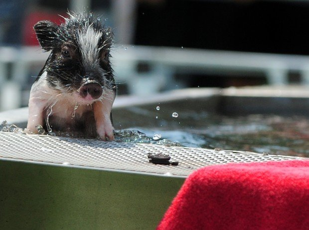

--- 
title: A book on R
author: "Milica Cudina"
date: "last updated -  `r Sys.Date()`"
documentclass: book
github-repo: gordanz/rbook
description: "A book on R"
site: bookdown::bookdown_site
---

# Preface {-}

This is a book on R. And this is Swifty

```{r echo=FALSE, out.width= "35%", out.extra='style="float:right; padding:10px"'}

