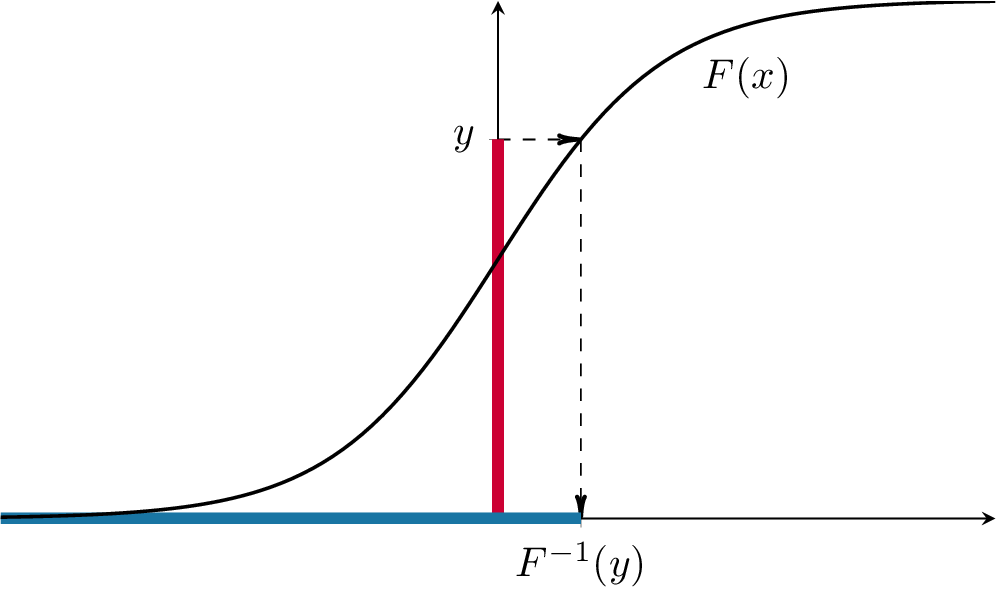

Let us perform an experiment where $X \sim N(0,1)$. Remembering that the cdf is given by the R function `pnorm`:

```{r}
x = rnorm(100000)
y = pnorm(x)
hist(y)
```


This looks like a histogram of a uniform distribution on $(0,1)$. 
Let's try with some other continuous distributions


```{r}
x1 = rexp(100000)
x2 = rcauchy(100000)
x3 = runif(100000)
x4 = rgamma(100000, shape=3)
par(mfrow=c(2,2))
hist(pexp(x1))
hist(pcauchy(x2))
hist(punif(x3))
hist(pgamma(x4, shape=3))
```


All of those point to the same conjecture, namely that $F(X)$ is 
uniformly distributed on $(0,1)$. 
To prove that, we 
take $Y=F(X)$ and try to compute that cdf $F_Y$ of $Y$:
$$F_Y(y) = \PP[ Y \leq y] = \PP[ F(X) \leq y]$$
Since $F$ is strictly increasing, it admits an inverse $F^{-1}$. 
Moreover, for any $y \in (0,1)$, 
the set of all values of $x$ such that $F(x)\leq y$ (the red range) is 
exactly the interval $(-\infty, F^{-1}(y)]$ (the blue range), as in 
the picture below:

<center>
```{r echo=FALSE, out.width= "60%", out.extra='style="padding:10px"'}
   
```

</center>  

Hence,  $$F_Y(y)=\PP[Y\leq y] = \PP[ F(X) \leq y] = \PP[ X \leq F^{-1}(y) ] = F(F^{-1}(y)) = y, 
\text{ for } y\in (0,1).$$ The cdf $F_Y$ is, therefore, equal to the cdf 
of a uniform on $(0,1)$.
Since the cdf uniquely determines the distribution,  $Y$ must be uniformly 
distributed on $(0,1)$. 

