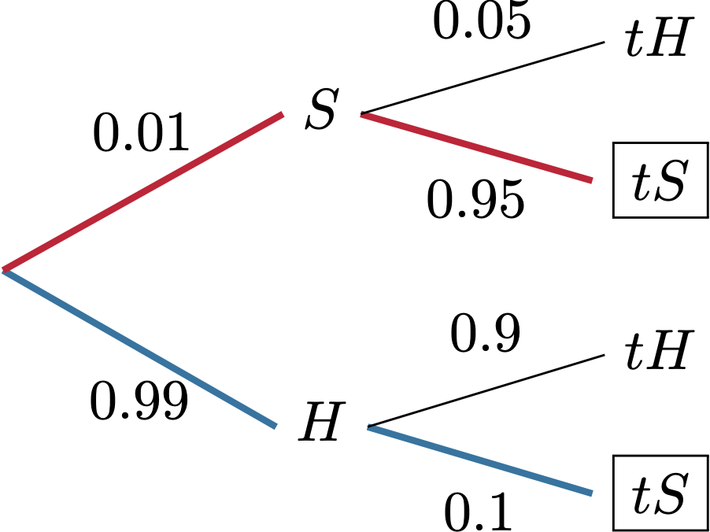

This is a classical example of the unexpected conclusions we sometimes get from the Bayes formula. As usual, we depict the situation using a tree diagram:
<center>
```{r echo=FALSE, out.width= "50%", out.extra='style="padding:10px"'}
   
```

</center>  
The person can test positive (denoted by $tS$ in the plot) in two ways. By actually being sick ($S$) and then testing positive, or by being healthy and then testing positive. Bayes formula (or simply a look at the picture above) gives us
$$ \PP[ S | tS ] = \frac{ 0.01 \times 0.95}{ 0.01\times 0.95 + 0.1\times 0.99 } \approx 0.088.$$
Thus, even when the test is quite accurate, the probability of getting a false positive is very high. 

Let us do the same via Monte Carlo. We proceed like this. First we "pick a person" from the population by sampling from `c("H", "S")` and then "test" this person. After repeating this `nsim` times, we condition on the positive test, by removing all draws where the test was negative. This leaves us with a population of people who tested positive, and we simply need to see what proportion of those were are actually sick.


```{r}
single_draw = function() {
   x = sample(c("H","S"), size=1, prob=c(0.99, 0.01))
   if ( x == "H" ) {
      y = sample(c("tH", "tS"), size=1, prob=c(0.9, 0.1))
   } else {
       y = sample(c("tH", "tS"), size=1, prob=c(0.05, 0.95))
   }
   return(c(x,y))
}

nsim=100000
df = data.frame( t(replicate(nsim, single_draw() )))
colnames(df) = c("status","test_result")

cond = (df$test_result == "tS")
df_cond = df[cond,]
(prob = mean(df_cond$status =="S"))
  
```

