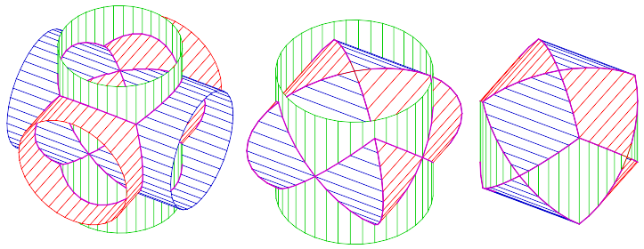

The **tricylinder** is a solid body constructed as follows: create three
cylinders of radius 1 around each of the three coordinate axes and intersect
them:

<figure style="
    display: flex;
    flex-flow: column;
    padding: 5px;
    margin: auto;">
 </img>
<figcaption style=" 
    background-color: #fff;
    color: #000;
    font: italic smaller sans-serif;
    padding: 3px;
    text-align: center;">
Image by Ag2gaeh - Own work, CC BY-SA 4.0, https://commons.wikimedia.org/w/index.php?curid=63604565 
</figcaption>
</figure>

Use Monte Carlo to estimate the volume of the tricylinder and 
check your estimate against the exact value $8(2-\sqrt{2})$. 

